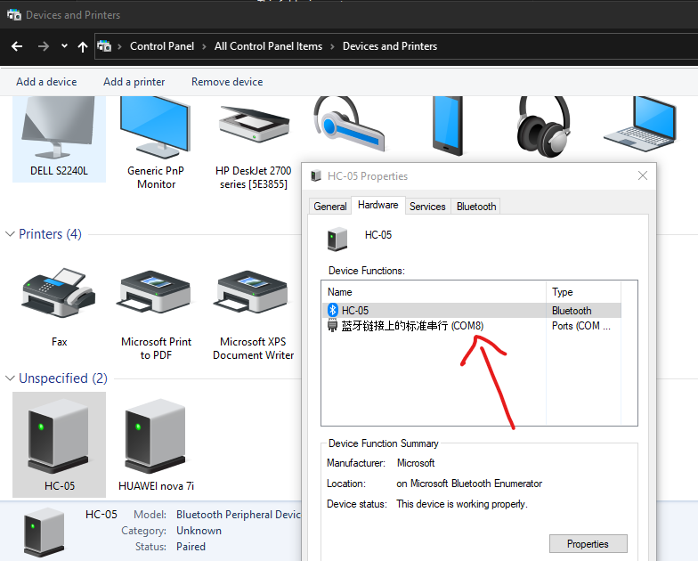

# Installation

## Hardware

1. Just get a HC-05 module and plug onto the Blietooth header on the shield.


## Software

1. Ensure that python and arduino IDE is installed on your system
2. Install the required libraries

    ```terminal
    pip install -r requirements.txt
    ```

3. Connect your laptop to HC-05 bluetooth module (pin: 1234).
4. (For windows) Go to Control Panel > Devices and Printers.
    Double click HC-05 and open Hardware tab.
    Look for the COM number of the device.
    Note: this value might change when it disconnects.

5. Open server.py and change the default port number("COM8").
6. Upload client.ino to Arduino. (You might want to remove bluetooth module if it fails)
7. Remove the USB connection and use batteries as power source.
8. Run server.py
